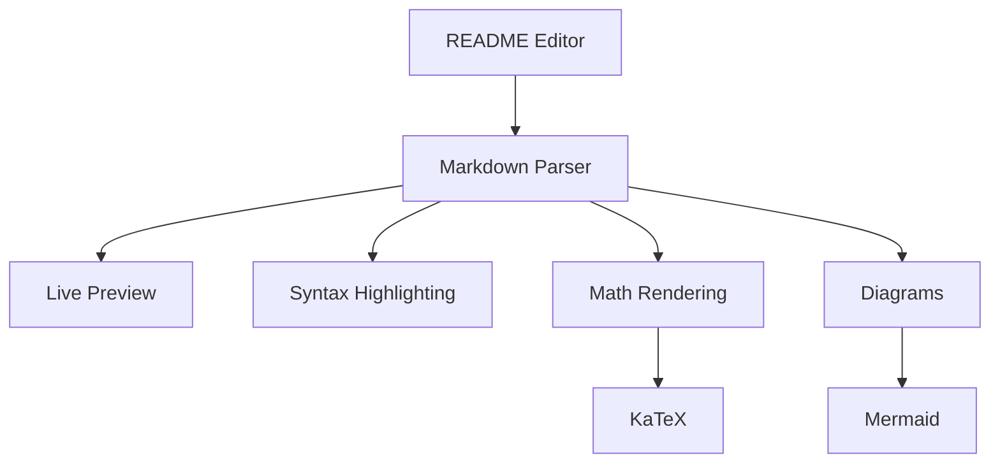

# Welcome to README Editor

This is a **powerful** online markdown editor designed for creating professional README files with advanced features.

## Features

- ✅ Live preview
- ✅ Syntax highlighting  
- ✅ Dark/light mode
- ✅ File upload/download
- ✅ GitHub-flavored markdown
- ✅ Math equations (KaTeX)
- ✅ Diagrams (Mermaid)
- ✅ PDF export

## Math Equations

Inline math: The quadratic formula is $x = \frac{-b \pm \sqrt{b^2 - 4ac}}{2a}$

Block math:
$$
\begin{aligned}
\nabla \cdot \vec{E} &= \frac{\rho}{\epsilon_0} \\
\nabla \cdot \vec{B} &= 0 \\
\nabla \times \vec{E} &= -\frac{\partial \vec{B}}{\partial t} \\
\nabla \times \vec{B} &= \mu_0\vec{J} + \mu_0\epsilon_0\frac{\partial \vec{E}}{\partial t}
\end{aligned}
$$

## Diagram Example



## Code Example

```javascript
function greet(name) {
  console.log(`Hello, ${name}!`);
}

greet("Developer");
```

## Table Example

| Feature | Status | Priority |
|---------|--------|----------|
| Live Preview | ✅ Done | High |
| Math Equations | ✅ Done | High |
| Diagrams | ✅ Done | High |
| PDF Export | ✅ Done | Medium |

## Task List

- [x] Create basic editor
- [x] Add live preview
- [x] Add math support
- [x] Add diagram support
- [x] Add PDF export
- [ ] Add collaboration features

> **Note**: This editor supports GitHub-flavored markdown with tables, task lists, math equations, and diagrams!

---

*Happy coding!* 🚀